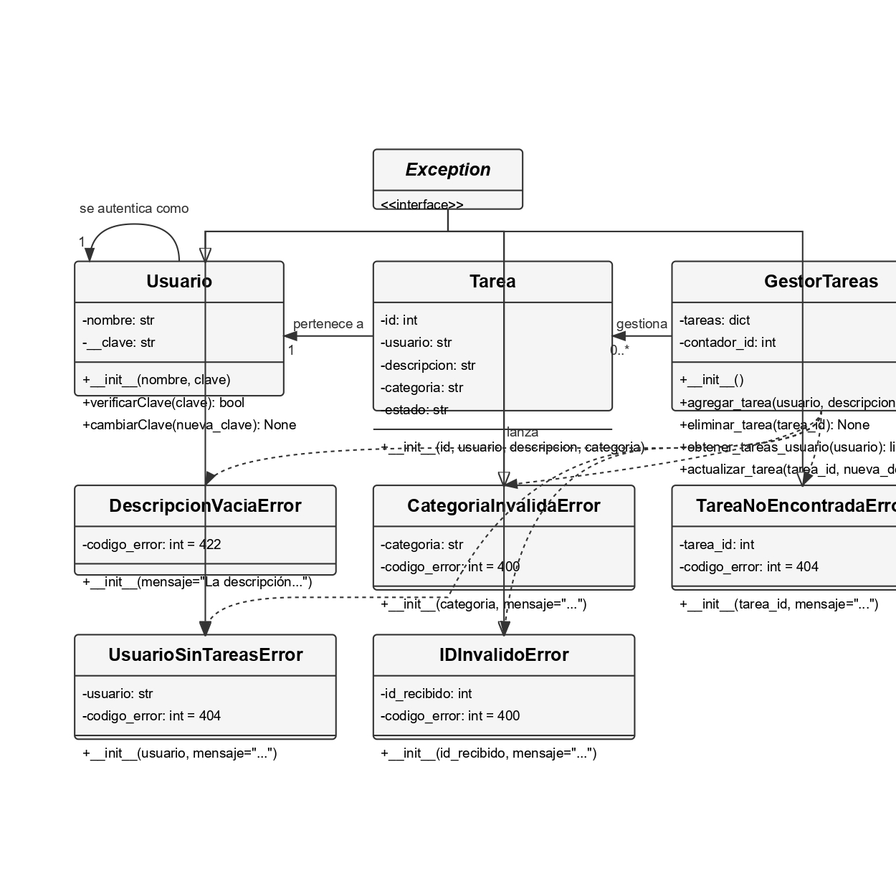

# Gestor_Tareas_2025
Integrantes: Santiago Calle L - Wilson Manuel Castillo Vergara - Proyecto De Aula Lenguajes de programación y Código Limpio 2025-1

Requisitos del Sistema

1. Crear una tarea: La aplicación debe permitir a los usuarios crear una tarea en el
sistema
2. Editar una tarea: La aplicación debe permitir a los usuarios editar una tarea existente
en el sistema
3. Eliminar una tarea: La aplicación debe permitir a los usuarios eliminar una tarea
existente en el sistema
4. Iniciar sesión: La aplicación debe permitir a los usuarios iniciar sesión en el sistema con
un usuario ya existente
5. Crear cuenta: Los usuarios deben poder darse de alta en el sistema
6. Cambiar contraseña: El sistema debe permitir a los usuarios cambiar sus contraseñas
cuando ellos lo deseen. 

---

### **Casos de Prueba - Gestión de Tareas**

| **Caso** | **Entrada**                                                                 | **Proceso**                                                                 | **Salida Esperada**                                                                 | **Resultado Obtenido**                                                                 |
|----------|-----------------------------------------------------------------------------|-----------------------------------------------------------------------------|------------------------------------------------------------------------------------|----------------------------------------------------------------------------------------|
| 1        | Usuario: `"usuario1"`, Descripción: `""`, Categoría: `"personal"`           | Agregar tarea con descripción vacía.                                         | Debe fallar porque la descripción no puede estar vacía.                             | Falla intencionalmente.                                                                |
| 2        | Usuario: `"usuario1"`, Descripción: `"Comprar leche"`, Categoría: `"deporte"` | Agregar tarea con categoría inválida.                                        | Debe fallar porque la categoría no es válida.                                       | Falla intencionalmente.                                                                |
| 3        | Usuario: `""`, Descripción: `"Tarea sin usuario"`, Categoría: `"trabajo"`    | Agregar tarea sin usuario.                                                   | Debe fallar porque el usuario no puede estar vacío.                                 | Falla intencionalmente.                                                                |
| 4        | Usuario: `"usuario1"`, Descripción: `"Reunión importante"`, Categoría: `""`  | Agregar tarea con categoría vacía.                                           | Debe fallar porque la categoría no puede estar vacía.                               | Falla intencionalmente.                                                                |
| 5        | Usuario: `"usuario1"`, Descripción: `"Comprar víveres"`, Categoría: `True`   | Agregar tarea con categoría de tipo booleano.                                | Debe fallar porque la categoría no puede ser un booleano.                           | Falla intencionalmente.                                                                |
| 6        | Usuario: `"usuario1"`, Descripción: `"😀🔥🎉"`, Categoría: `"personal"`       | Agregar tarea con emojis en la descripción.                                  | La tarea se agrega correctamente.                                                  | La tarea se agrega correctamente.                                                      |
| 7        | Usuario: `"usuario1"`, Descripción: `"Texto con 1234 !@#$%^&*()_+"`, Categoría: `"personal"` | Agregar tarea con caracteres especiales en la descripción.                  | La tarea se agrega correctamente.                                                  | La tarea se agrega correctamente.                                                      |
| 8        | Usuario: `"usuario1"`, Descripción: `"Investigar temas"`, Categoría: `"12345"` | Agregar tarea con categoría que solo tiene números.                         | Debe fallar porque la categoría no puede ser solo números.                          | Falla intencionalmente.                                                                |
| 9        | Usuario: `"usuario1"`, Descripción: `"Comprar regalos"`, Categoría: `"    "` | Agregar tarea con categoría que solo tiene espacios.                        | Debe fallar porque la categoría no puede estar vacía.                               | Falla intencionalmente.                                                                |
| 10       | Usuario: `"    "`, Descripción: `"Revisar agenda"`, Categoría: `"personal"`  | Agregar tarea con usuario que solo tiene espacios.                          | Debe fallar porque el usuario no puede estar vacío.                                 | Falla intencionalmente.                                                                |
| 11       | Usuario: `"usuario1"`, Descripción: `"   Limpiar casa   "`, Categoría: `"personal"` | Agregar tarea con espacios externos en la descripción.                      | La tarea se agrega correctamente con los espacios.                                 | La tarea se agrega correctamente con los espacios.                                      |
| 12       | Usuario: `"usuario1"`, Descripción: `"Proyecto final"`, Categoría: `"estudio"` | Agregar tarea con categoría válida.                                         | La tarea se agrega correctamente.                                                  | La tarea se agrega correctamente.                                                      |
| 13       | Usuario: `"usuario1"`, Descripción: `"Lavar    el coche"`, Categoría: `"personal"` | Agregar tarea con espacios internos en la descripción.                      | La tarea se agrega correctamente con los espacios.                                 | La tarea se agrega correctamente con los espacios.                                      |
| 14       | Usuario: `"usuario1"`, Descripción: `"TAREA IMPORTANTE"`, Categoría: `"trabajo"` | Agregar tarea con mayúsculas en la descripción.                             | La tarea se agrega correctamente.                                                  | La tarea se agrega correctamente.                                                      |
| 15       | Usuario: `"usuario1"`, Descripción: `"tarea_proyecto"`, Categoría: `"trabajo"` | Agregar tarea con guion bajo en la descripción.                             | La tarea se agrega correctamente.                                                  | La tarea se agrega correctamente.                                                      |
| 16       | Usuario: `"usuario1"`, Descripción: `"Nuevo reto"`, Categoría: `"trabajo"`   | Agregar tarea con dos palabras en la descripción.                           | La tarea se agrega correctamente.                                                  | La tarea se agrega correctamente.                                                      |
| 17       | Usuario: `"usuario1"`, Descripción: `"Reporte 2025"`, Categoría: `"trabajo"` | Agregar tarea con números y texto en la descripción.                        | La tarea se agrega correctamente.                                                  | La tarea se agrega correctamente.                                                      |
| 18       | Usuario: `"usuario1"`, Descripción: `"  Meta del año  "`, Categoría: `"trabajo"` | Agregar tarea con espacios finales en la descripción.                       | La tarea se agrega correctamente con los espacios.                                 | La tarea se agrega correctamente con los espacios.                                      |
| 19       | Usuario: `"usuario1"`, Descripción: `"Hacer ejercicio"`, Categoría: `"trabajo"` | Agregar tarea y verificar longitud del texto.                               | La descripción tiene más de 5 caracteres.                                           | La descripción tiene más de 5 caracteres.                                               |
| 20       | Usuario: `"usuario1"`, Descripción: `"Leer un libro"`, Categoría: `"personal"` | Agregar tarea personal.                                                    | La tarea se agrega correctamente.                                                  | La tarea se agrega correctamente.                                                      |
| 21       | Usuario: `"usuario1"`, Descripción: `"Entrega informe"`, Categoría: `"trabajo"` | Agregar tarea duplicada.                                                   | Ambas tareas se agregan correctamente.                                              | Ambas tareas se agregan correctamente.                                                  |
| 22       | Usuario: `"usuario1"`, Descripción: `"Tarea especial"`, Categoría: `"trabajo"` | Agregar tarea y verificar usuario correcto.                                | El usuario es correcto.                                                            | El usuario es correcto.                                                                |
| 23       | Usuario: `"usuario1"`, Descripción: `"Estudiar matemática"`, Categoría: `"trabajo"` | Agregar tarea y verificar palabra clave.                                  | La descripción contiene la palabra clave.                                          | La descripción contiene la palabra clave.                                              |
| 24       | Usuario: `"usuario1"`, Descripción: `"Investigación"`, Categoría: `"trabajo"` | Agregar y actualizar tarea varias veces.                                   | La descripción se actualiza correctamente.                                         | La descripción se actualiza correctamente.                                             |
| 25       | Usuario: `"usuario1"`, Descripción: `"Reporte 2025"`, Categoría: `"trabajo"` | Agregar tarea y verificar texto con números.                                | La descripción contiene números.                                                   | La descripción contiene números.                                                       |
| 26       | Usuario: `"usuario1"`, Descripción: `"  Meta del año  "`, Categoría: `"trabajo"` | Agregar tarea y verificar espacios finales.                                | La descripción se almacena correctamente.                                          | La descripción se almacena correctamente.                                              |

---

### **Casos de Prueba - Actualización de Tareas**

| **Caso** | **Entrada**                                                                 | **Proceso**                                                                 | **Salida Esperada**                                                                 | **Resultado Obtenido**                                                                 |
|----------|-----------------------------------------------------------------------------|-----------------------------------------------------------------------------|------------------------------------------------------------------------------------|----------------------------------------------------------------------------------------|
| 27       | ID: `1`, Nueva descripción: `"Perfil actualizado"`                         | Actualizar tarea existente.                                                 | La descripción de la tarea se actualiza correctamente.                             | La descripción de la tarea se actualiza correctamente.                                 |
| 28       | ID: `1`, Nueva descripción: `"Revisar documentos"`                         | Actualizar tarea con el mismo texto.                                        | La descripción de la tarea no cambia.                                              | La descripción de la tarea no cambia.                                                  |
| 29       | ID: `1`, Nueva descripción: `"Presentación lista"`                         | Actualizar tarea con nueva descripción.                                     | La descripción de la tarea se actualiza correctamente.                             | La descripción de la tarea se actualiza correctamente.                                 |
| 30       | ID: `1`, Nueva descripción: `"A" * 500`                                    | Actualizar tarea con texto largo.                                           | La descripción de la tarea se actualiza correctamente.                             | La descripción de la tarea se actualiza correctamente.                                 |
| 31       | ID: `1`, Nueva descripción: `"Vacaciones planificadas"`                    | Actualizar tarea y verificar usuario.                                       | El usuario de la tarea sigue siendo el mismo.                                      | El usuario de la tarea sigue siendo el mismo.                                          |
| 32       | ID: `1`, Nueva descripción: `"Matemática avanzada"`                        | Actualizar tarea y verificar palabra clave.                                 | La descripción de la tarea contiene la palabra clave.                              | La descripción de la tarea contiene la palabra clave.                                  |
| 33       | ID: `1`, Nueva descripción: `"Informe finalizado"`                         | Actualizar tarea varias veces.                                              | La descripción de la tarea se actualiza correctamente.                             | La descripción de la tarea se actualiza correctamente.                                 |
| 34       | ID: `1`, Nueva descripción: `"Datos analizados correctamente"`             | Actualizar tarea y verificar longitud del texto.                            | La descripción tiene más de 5 caracteres.                                           | La descripción tiene más de 5 caracteres.                                               |

---

### **Casos de Prueba - Eliminación de Tareas**

| **Caso** | **Entrada**                                                                 | **Proceso**                                                                 | **Salida Esperada**                                                                 | **Resultado Obtenido**                                                                 |
|----------|-----------------------------------------------------------------------------|-----------------------------------------------------------------------------|------------------------------------------------------------------------------------|----------------------------------------------------------------------------------------|
| 35       | ID: `1`                                                                    | Eliminar tarea existente.                                                   | La tarea se elimina correctamente.                                                 | La tarea se elimina correctamente.                                                     |
| 36       | ID: `1`                                                                    | Eliminar tarea ya eliminada.                                                | Debe fallar porque la tarea ya fue eliminada.                                       | Falla intencionalmente.                                                                |
| 37       | ID: `1`                                                                    | Eliminar tarea y reagregar con el mismo ID.                                 | La nueva tarea se agrega correctamente.                                            | La nueva tarea se agrega correctamente.                                                |
| 38       | ID: `2`                                                                    | Eliminar tarea intermedia y verificar lista.                                | La lista de tareas se actualiza correctamente.                                     | La lista de tareas se actualiza correctamente.                                         |
| 39       | ID: `1`                                                                    | Eliminar tarea y verificar lista vacía.                                     | La lista de tareas está vacía.                                                     | La lista de tareas está vacía.                                                         |
| 40       | ID: `1`                                                                    | Eliminar tarea y verificar lista no vacía.                                  | La lista de tareas no está vacía.                                                  | La lista de tareas no está vacía.                                                      |

---

### **Casos de Prueba - Obtener Tareas**

| **Caso** | **Entrada**                                                                 | **Proceso**                                                                 | **Salida Esperada**                                                                 | **Resultado Obtenido**                                                                 |
|----------|-----------------------------------------------------------------------------|-----------------------------------------------------------------------------|------------------------------------------------------------------------------------|----------------------------------------------------------------------------------------|
| 41       | Usuario: `"usuario_inexistente"`                                           | Obtener tareas de un usuario sin tareas.                                    | Debe fallar porque el usuario no tiene tareas.                                      | Falla intencionalmente.                                                                |
| 42       | Usuario: `"1234"`                                                          | Obtener tareas de un usuario numérico.                                      | La tarea se obtiene correctamente.                                                 | La tarea se obtiene correctamente.                                                     |
| 43       | Usuario: `"usuario1"`                                                      | Obtener tareas de un usuario con una tarea.                                 | La tarea se obtiene correctamente.                                                 | La tarea se obtiene correctamente.                                                     |
| 44       | Usuario: `"usuario2"`                                                      | Obtener tareas de un usuario diferente.                                     | La tarea se obtiene correctamente.                                                 | La tarea se obtiene correctamente.                                                     |
| 45       | Usuario: `"usuario1"`                                                      | Obtener tareas de un usuario con dos tareas.                                | Las tareas se obtienen correctamente.                                              | Las tareas se obtienen correctamente.                                                  |
| 46       | Usuario: `"usuario1"`                                                      | Obtener tareas después de eliminar tareas.                                  | La lista de tareas está vacía.                                                     | La lista de tareas está vacía.                                                         |
| 47       | Usuario: `"usuario1"`                                                      | Obtener tareas de un usuario con múltiples tareas.                          | Las tareas se obtienen correctamente.                                              | Las tareas se obtienen correctamente.                                                  |
| 48       | Usuario: `"usuario1"`                                                      | Obtener tareas de un usuario con tareas eliminadas.                         | La lista de tareas se actualiza correctamente.                                     | La lista de tareas se actualiza correctamente.                                         |

---

### **Casos de Prueba - Varios**

| **Caso** | **Entrada**                                                                 | **Proceso**                                                                 | **Salida Esperada**                                                                 | **Resultado Obtenido**                                                                 |
|----------|-----------------------------------------------------------------------------|-----------------------------------------------------------------------------|------------------------------------------------------------------------------------|----------------------------------------------------------------------------------------|
| 49       | Usuario: `"usuario1"`, Descripción: `"Entrega informe"`, Categoría: `"trabajo"` | Agregar tarea duplicada.                                                   | Ambas tareas se agregan correctamente.                                              | Ambas tareas se agregan correctamente.                                                  |
| 50       | Usuario: `"usuario1"`, Descripción: `"Hacer ejercicio"`, Categoría: `"trabajo"` | Verificar longitud de la descripción.                                      | La descripción tiene más de 5 caracteres.                                           | La descripción tiene más de 5 caracteres.                                               |
| 51       | Usuario: `"usuario1"`, Descripción: `"Leer un libro"`, Categoría: `"personal"` | Verificar tarea personal.                                                  | La tarea se agrega correctamente.                                                  | La tarea se agrega correctamente.                                                      |
| 52       | Usuario: `"usuario1"`, Descripción: `"Tarea especial"`, Categoría: `"trabajo"` | Verificar usuario correcto.                                                | El usuario es correcto.                                                            | El usuario es correcto.                                                                |
| 53       | Usuario: `"usuario1"`, Descripción: `"Estudiar matemática"`, Categoría: `"trabajo"` | Verificar palabra clave.                                                  | La descripción contiene la palabra clave.                                          | La descripción contiene la palabra clave.                                              |
| 54       | Usuario: `"usuario1"`, Descripción: `"Investigación"`, Categoría: `"trabajo"` | Agregar y actualizar tarea varias veces.                                   | La descripción se actualiza correctamente.                                         | La descripción se actualiza correctamente.                                             |

---
DIAGRAMA DE CLASES 

