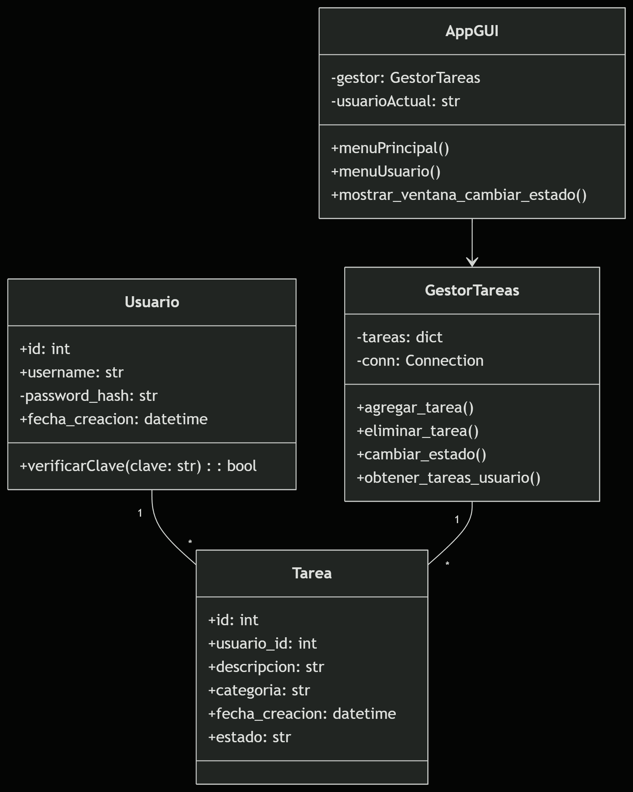

# Gestor_Tareas_2025

**Integrantes**: Santiago Calle L - Wilson Manuel Castillo Vergara  
**Proyecto De Aula**: Lenguajes de programación y Código Limpio 2025-1

## 🚀 Novedades en la Versión 2.0

### 🔄 Sistema de Gestión de Estados
- **Nuevo campo `estado`** con tres valores posibles:
  - ✅ `Completada`
  - ⏳ `Pendiente` (valor por defecto)
  - ❌ `Sin realizar`
- Eliminación del campo booleano `completada`
- Interfaz gráfica actualizada con selector de estados

### 🛠️ Mejoras en la Base de Datos
- Migración completa del esquema de base de datos
- Nuevas vistas optimizadas (`vista_estadisticas_tareas`, `reporte_productividad`)
- Eliminación de tablas redundantes (`categorias`)
- Simplificación de la estructura de usuarios

### 🖥️ Mejoras en la Interfaz
- Nueva ventana para gestión de estados
- Visualización mejorada de tareas con colores por estado
- Menú principal reorganizado

## 📋 Requisitos del Sistema Actualizados

1. **Gestión de Tareas**:
   - Crear tareas con categorías (trabajo/personal/estudio)
   - Editar descripción de tareas existentes
   - Cambiar estado de tareas (Completada/Pendiente/Sin realizar)
   - Eliminar tareas

2. **Gestión de Usuarios**:
   - Crear cuenta con autenticación segura
   - Iniciar sesión con validación de credenciales
   - Cerrar sesión

3. **Visualización**:
   - Ver listado completo de tareas
   - Filtrar tareas por estado
   - Estadísticas de productividad

## 🧪 Casos de Prueba Unitarios (60+)

### Pruebas de Agregar Tarea (Actualizadas)

| Caso | Descripción | Entrada | Salida Esperada | Categoría |
|------|-------------|---------|-----------------|-----------|
| 1 | Agregar tarea con nuevo sistema de estados | Estado: "Completada" | Tarea creada con estado correcto | trabajo |
| 2 | Validar estado por defecto | - | Estado inicial: "Pendiente" | personal |

### Nuevas Pruebas de Estado

| Caso | Descripción | Estado Inicial | Estado Nuevo | Resultado Esperado |
|------|-------------|----------------|--------------|---------------------|
| 55 | Cambiar estado a Completada | Pendiente | Completada | Actualización exitosa |
| 56 | Cambiar estado a Sin realizar | Completada | Sin realizar | Actualización exitosa |

---
## 📊 Diagrama de Clases

---

### **Nuevas funcionalidades añadidas**

1. **Interfaz gráfica (GUI) funcional con Tkinter**:  
   La aplicación cuenta con una GUI amigable que permite al usuario crear cuenta, iniciar sesión y gestionar tareas desde una ventana visual.

2. **Manejo de sesiones**:  
   Los usuarios deben iniciar sesión para realizar acciones como agregar, ver o eliminar tareas. No se puede interactuar con el sistema sin autenticación previa.

3. **Encapsulamiento de datos**:  
   Se aplican principios de Programación Orientada a Objetos. Por ejemplo, las contraseñas están protegidas como atributos privados (`__clave`) dentro de la clase `Usuario`.

4. **Contraseñas protegidas**:  
   El sistema solicita una contraseña en el registro e inicio de sesión. La contraseña se valida internamente usando métodos personalizados (`verificarClave`).

5. **Docstrings profesionales**:  
   Todos los módulos, clases y métodos cuentan con documentación en formato docstring, siguiendo buenas prácticas de código limpio.

6. **Separación por capas**:  
   El proyecto se organiza en capas de modelo (`models`), servicios (`services`), excepciones (`exceptions`), pruebas (`tests`) y vista (`Vista`), cumpliendo el patrón MVC adaptado.

7. **Pruebas unitarias (Pytest)**:  
   Se implementaron **más de 54 casos de prueba** para validar entradas, errores, límites, y estados del sistema. El archivo `tests/test_tareas.py` tiene cobertura alta.

8. **Menú por consola mejorado**:  
   Además de la GUI, se ofrece un menú de texto completamente funcional, con control de sesión y restricciones para garantizar la integridad de uso.

---
